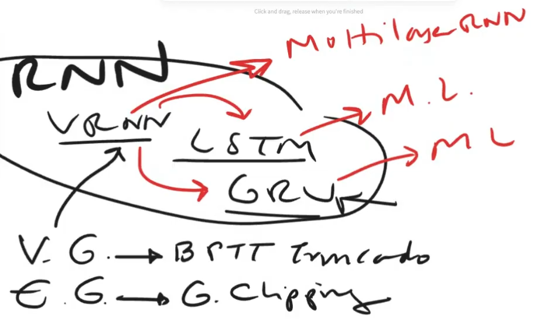
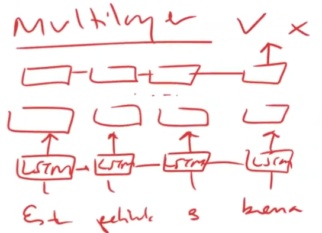
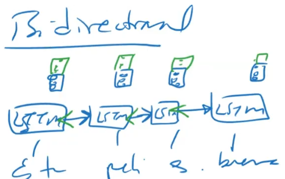
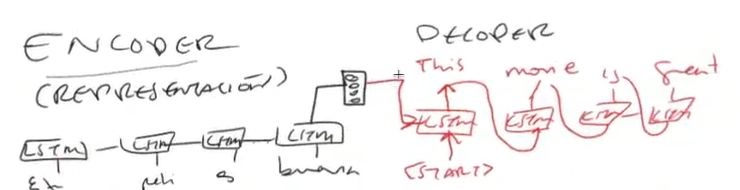
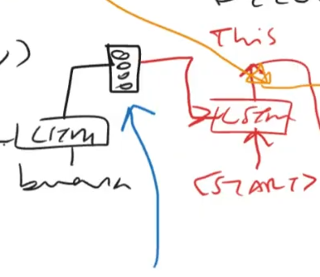
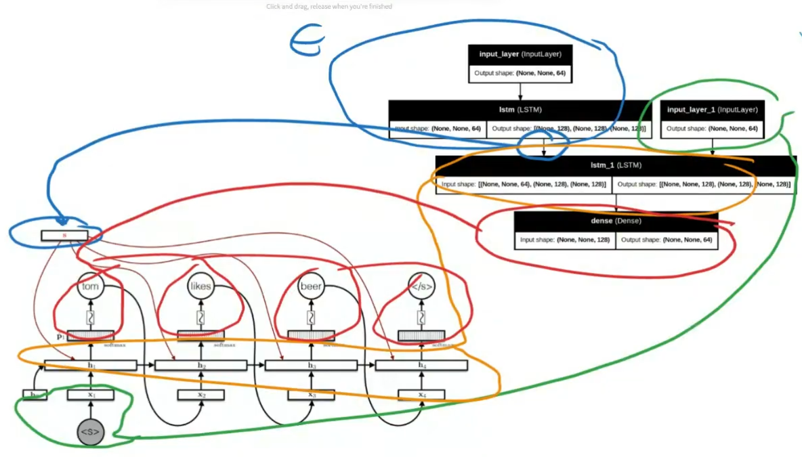
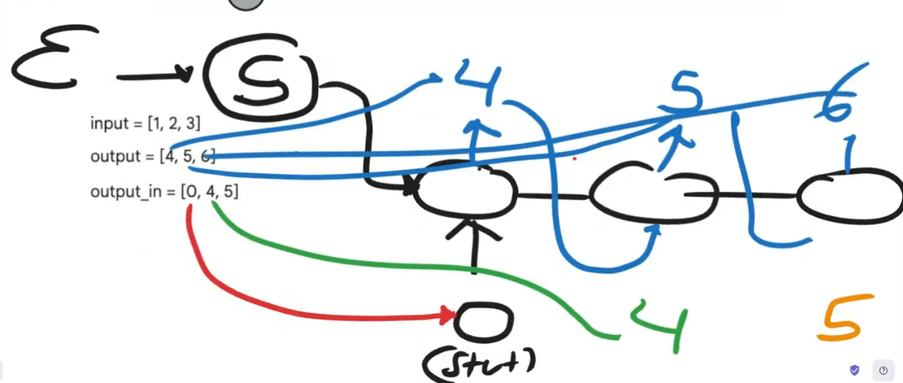

# Repaso de contenidos

## Variantes de CNN

Vanilla RNN tiene problemas de gradientes, Vanishing Gradients y Exploding Gradients, por lo que se han desarrollado variantes como LSTM y GRU para abordar este problema. Estas variantes introducen mecanismos de puertas para controlar el flujo de información a través de la red, lo que les permite capturar dependencias a largo plazo en los datos secuenciales.

Para robustecer la arquitectura se usa Multi layer RNN, que consiste en apilar varias capas de RNN para aumentar la capacidad de modelado. Esto permite a la red aprender representaciones más complejas y abstractas de los datos secuenciales. Tambien se puede aplicar Bidirectional RNN, que procesa la secuencia en ambas direcciones (hacia adelante y hacia atrás) para capturar información contextual de ambos lados de la secuencia.

La bidireccional es util para **representación** de texto, ya que el contexto de una palabra puede depender tanto de las palabras anteriores como de las posteriores. Pero no es bueno para tareas de **generación** de texto, ya que no se puede usar la información futura para generar la palabra actual.

# Sequence to Sequence (Seq2Seq)

Esta arquitectura combina los conceptos de representación y generación. Se compone de dos partes principales: un codificador (encoder) y un decodificador (decoder). El codificador procesa la secuencia de entrada y genera una representación interna, mientras que el decodificador utiliza esta representación para generar la secuencia de salida.

\<START> es el token que indica el inicio de la secuencia de salida, y \<END> es el token que indica el final de la secuencia de salida. Durante el entrenamiento, el decodificador recibe la secuencia de salida real (con \<START> y \<END>) como entrada para aprender a generar la secuencia correcta. Durante la inferencia, el decodificador genera la secuencia de salida paso a paso, utilizando su propia salida anterior como entrada para generar la siguiente palabra, hasta que se genera el token \<END>.

### Limitaciones de Seq2Seq
Seq2Seq tiene la limitación de que el codificador debe comprimir toda la información de la secuencia de entrada en un solo vector (cuello de botella), lo que puede ser difícil para secuencias largas. Para abordar este problema, se introdujo el mecanismo de atención (attention), que permite al decodificador acceder a diferentes partes de la secuencia de entrada durante el proceso de generación, en lugar de depender únicamente del vector de contexto generado por el codificador. Esto mejora significativamente el rendimiento del modelo en tareas como la traducción automática y el resumen de texto.

Otro problema es que el uso de RNNs (GRU o LSTM) procesan la entrada de forma secuencial, por lo cual no se puede paralelizar la entrada.

Esto se puede resolver al poner Attention en el encoder, y si ademas se usa Attention en el decoder se tiene un modelo **Transformer**, que es el modelo mas usado actualmente para tareas de NLP. El Transformer se basa en el mecanismo de atención y no utiliza RNNs, lo que permite procesar la entrada de forma paralela y manejar secuencias más largas de manera eficiente.

Implementación de Seq2Seq:

### Ejemplo de Seq2Seq
En el ejemplo de encoder-decoder con numero, el armado del dataset se hace de la siguiente manera:

